# Sidewalk Kings

An original 2D side-scrolling open-world beat-'em-up RPG, built in Godot 4.

You come back to Riverbend after two years away and find four blocks under four gangs
who have suddenly, inexplicably, stopped fighting each other. Somebody is paying them.
The money is folded very neatly, which turns out to matter.

Everything in this repository is original: characters, places, dialogue, artwork,
animation, music, sound effects and level layouts. Nothing is taken from an existing game.

**Version:** 0.1.1 · **Engine:** Godot 4.7.2 · **Language:** GDScript

**▶ [Play it in your browser](https://outerheavenx.github.io/sidewalk-kings/)**

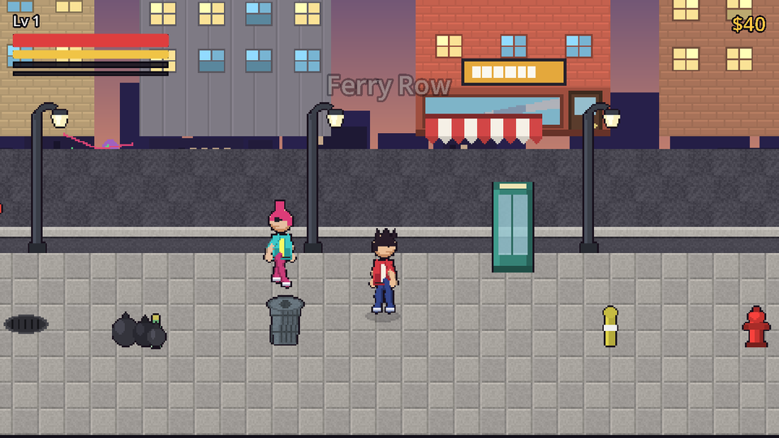

| | |
|---|---|
| 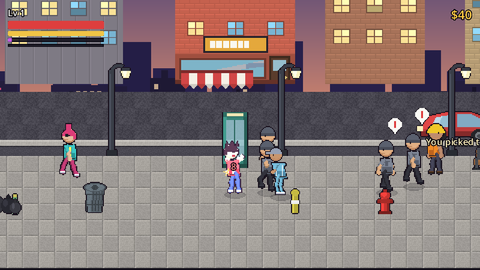 | 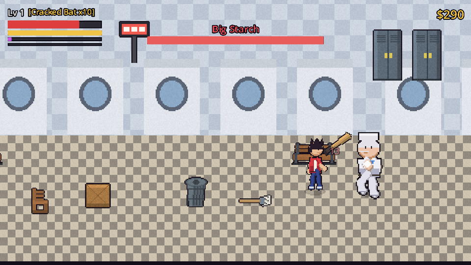 |
| 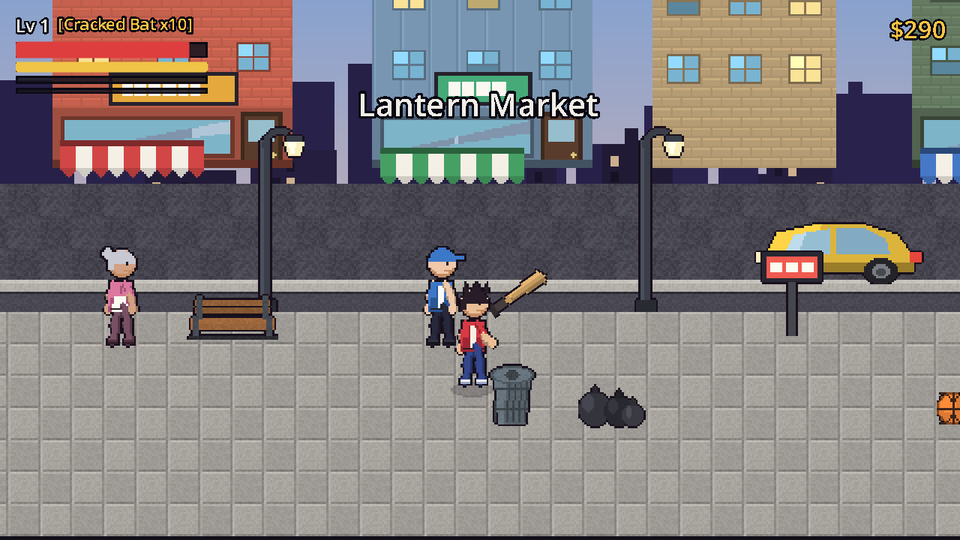 | 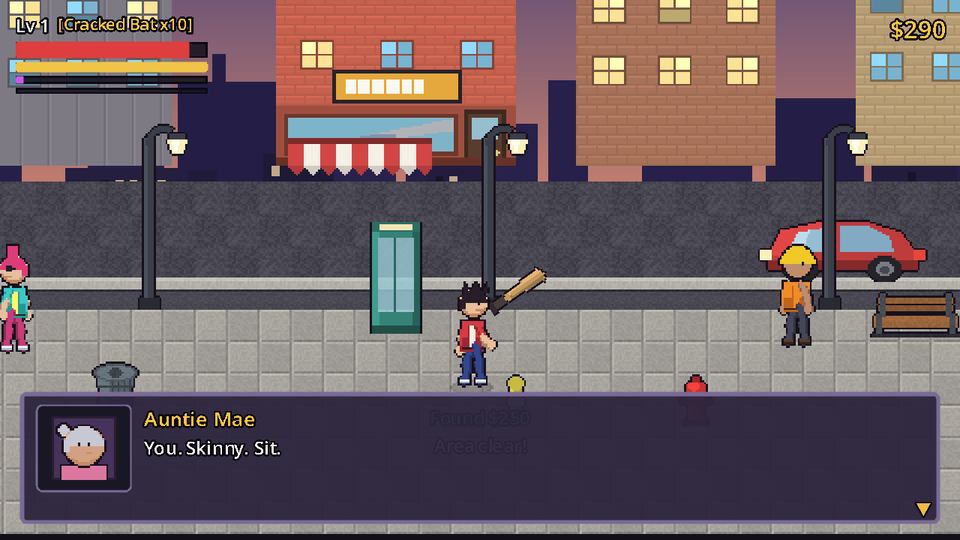 |
| 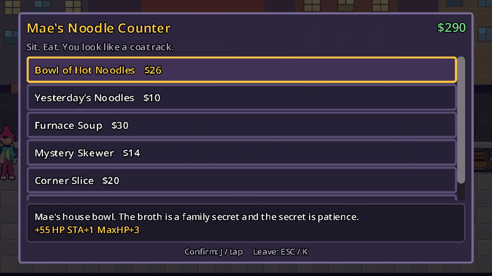 | 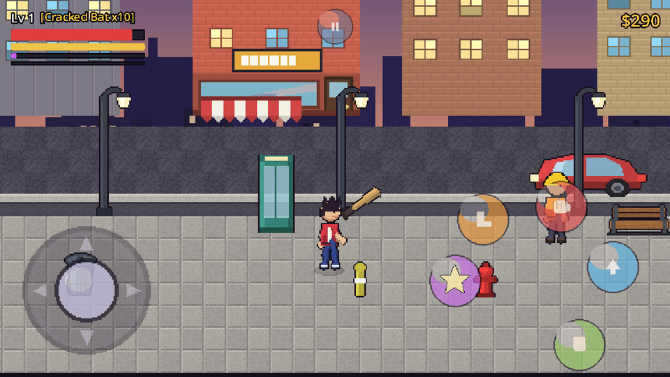 |
| 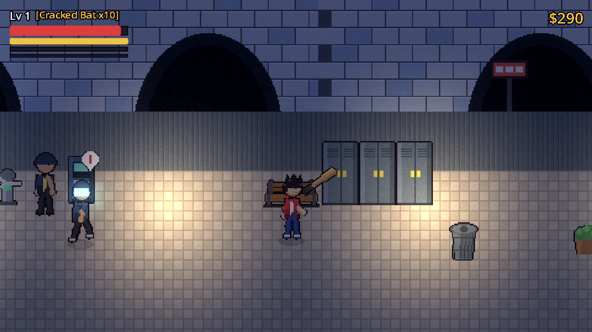 | 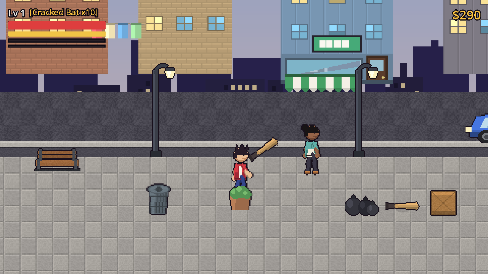 |
| 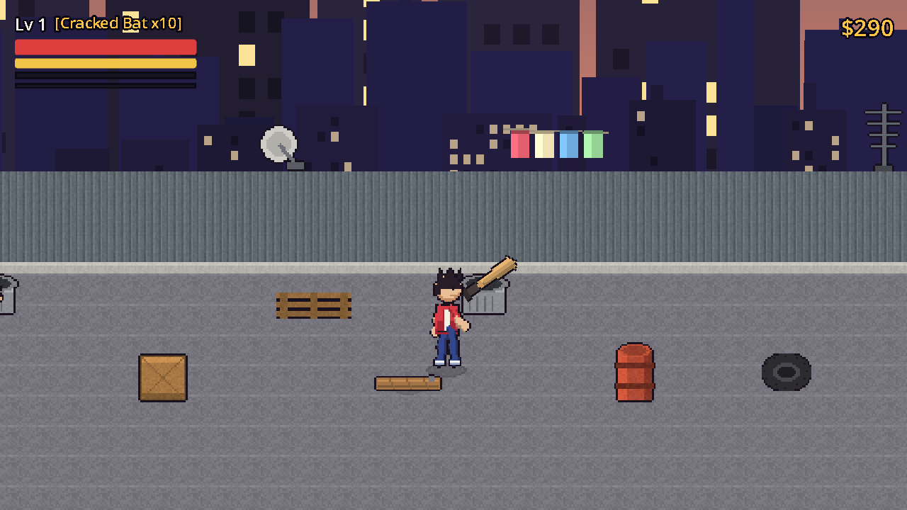 | 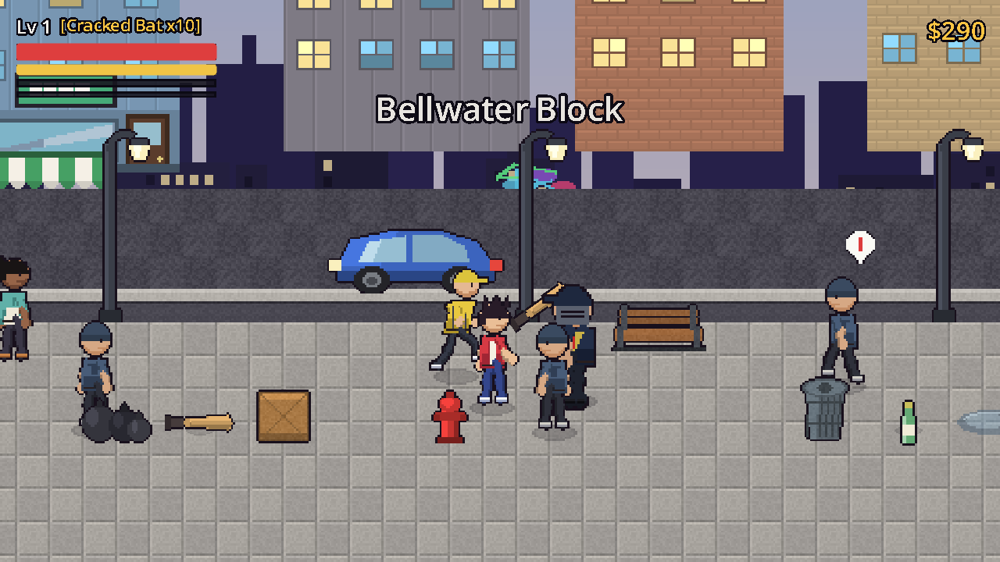 |

---

## Play it

### In a browser

It is live at **https://outerheavenx.github.io/sidewalk-kings/**, deployed from `main` by
GitHub Actions.

The same build is committed at [`web/`](web/). Serve that folder over HTTP and open
`index.html`. It is a static site: no Node, no build step, no server code.

```bash
python -m http.server 8000 --directory web
```

Then open `http://localhost:8000`.

Opening `web/index.html` directly from the file system will **not** work: browsers block
WebAssembly over `file://`. It must be served over http or https.

### In the editor

1. Install [Godot 4.7.2](https://godotengine.org/download) (standard build, not .NET).
2. Open `project.godot`.
3. Press **F5**.

The game boots to a title screen, so F5 and F6 both work.

---

## Controls

| Action | Keyboard | Gamepad | Touch |
|---|---|---|---|
| Move | Arrows / WASD | Left stick, D-pad | Virtual stick, lower left |
| Run | Shift **while moving** | LB / L1 | Push the stick to its edge |
| Guard | Shift **while standing still** | LB / L1 | Shield button |
| Dodge roll | Double-tap a direction | Double-tap a direction | Double-flick the stick |
| Light attack | J or Z | X / Square | Red button |
| Heavy attack | K or X | Y / Triangle | Orange button |
| Jump | L or Space | A / Cross | Blue button |
| Grab / interact | U or C | B / Circle | Green button |
| Special | I or V | RB / R1 | Purple button |
| Pause | Esc or P | Start | Top-centre button |
| Debug panel | F1 | — | — |

Touch controls appear by themselves on a touchscreen and can be forced on from
**Pause → Settings**. Every button and the stick tracks its own touch, so moving and
attacking at the same time works.

### Combat, briefly

- Light, light, light chains **Jab → Cross → Body Hook**. Each link only opens once the
  previous hit connects.
- Heavy from anywhere in that chain finishes with a knockdown.
- Grab a staggered enemy with **U**, then light attacks to work them over, or heavy /
  jump to throw them. A thrown body knocks over whoever it lands on.
- Weapons on the ground are picked up with **U**, swung with light, thrown with heavy.
  Most break after a few hits.
- Jumping dodges grounded attacks, and a jump attack catches enemies who are standing.
- **Guard** holds against ordinary attacks for a sliver of chip damage, but heavy blows
  break through it. It drains energy while held, so it is a trade rather than a safe
  default. You cannot move or attack while guarding.
- **Dodge roll** on a double-tap. Invulnerable through most of it, costs energy, and
  commits you. **Dash Strike**, once bought from the dojo, is its follow-up.
- The special meter fills as you land and take hits. At full, **I** clears the space
  around you.

---

## Repository layout

```
autoload/        Singletons: EventBus, GameManager, SaveManager, SceneManager,
                 AudioManager, InputManager, ContentDB, plus PlayerState
actors/          Player, EnemyBase, Boss, the shared Actor base, EnemyData
combat/          MoveData, DamageData, Hitbox, Hurtbox, CombatController, FX
weapons/         WeaponBase, WeaponData, Projectile
world/           Area (built from data), GameCamera, NPC, doors, props, pickups
systems/         EnemyDirector, QuestManager, DialogueManager, ShopManager
ui/              HUD, dialogue box, shops, pause menu, title screen, touch controls
data/            All game content as resources (see "Where content lives")
assets/          Generated art and audio
tools/           The generators that produce assets, scenes and content
tests/           SmokeTest.gd (automated QA) and ScreenshotTool.gd (visual capture)
docs/            Design and engineering documentation
web/             The exported browser build (committed, deployable as-is)
```

## Where content lives

Gameplay content is data, not code. Adding to the game usually means adding a file.

| Content | Location | Type |
|---|---|---|
| Attacks and techniques | `data/moves/*.tres` | `MoveData` |
| Enemies | `data/enemies/*.tres` | `EnemyData` |
| Encounters and waves | `data/encounters/*.tres` | `EncounterData` |
| Food | `data/food/*.tres` | `FoodData` |
| Books | `data/books/*.tres` | `BookData` |
| Items and key items | `data/items/*.tres` | `ItemData` |
| Weapons | `data/weapons/*.tres` | `WeaponData` |
| Shops | `data/shops/*.tres` | `ShopData` |
| Quests | `data/quests/*.tres` | `QuestData` |
| Dialogue | `data/dialogue/*.tres` | `DialogueData` |
| Area metadata | `data/areas/*.tres` | `AreaData` |
| Area layouts | `data/areas/*.json` | JSON read by `Area.gd` |

`ContentDB` loads all of it at startup and exposes it by id. Nothing needs registering.

These files are produced by the generators in `tools/`, which are the source of truth for
balance and writing. See [docs/CONTENT_PIPELINE.md](docs/CONTENT_PIPELINE.md).

---

## Saves

Saves are versioned JSON in `user://saves/slot_0.json`.

- On desktop that is the usual Godot user data folder.
- On the web it is IndexedDB, so a save survives a page reload and a browser restart.

Saving is manual, from **Pause → Save**. The title screen offers **Continue** when a save
exists and shows its level, money and location. The schema carries a `save_version`, and
`SaveManager.migrate()` upgrades older files one version at a time.

Full detail in [docs/SAVE_SYSTEM.md](docs/SAVE_SYSTEM.md).

---

## Building for desktop

Presets for Windows and Linux (which covers the Steam Deck) are committed.

```bash
godot --headless --path . --export-release "Windows Desktop" build/windows/SidewalkKings.exe
godot --headless --path . --export-release "Linux" build/linux/SidewalkKings.x86_64
```

Both embed the game data in a single executable. `build/` is not committed.

To check audio on a machine where it seems wrong:

```bash
SidewalkKings.exe -- --audio
```

That prints the driver, bus volumes, whether every sound resolves, and whether music is set
to loop.

## Building the web export

Requires Godot 4.7.2 with the matching export templates installed.

```bash
godot --headless --path . --export-release "Web" web/index.html
```

The preset is committed as `export_presets.cfg`. It uses the custom shell at
`web/shell.html` for the loading screen, and builds without thread support so the result
can be hosted on any plain static host with no special headers.

Details, including deployment to GitHub Pages and Cloudflare Pages, are in
[docs/WEB_EXPORT.md](docs/WEB_EXPORT.md).

---

## Tests

```bash
godot --headless --path . -- --smoke
```

Runs 227 automated checks against a real session: content integrity, movement, every
attack, the combo chain, grabs and throws, enemy AI, weapons and durability, pickups,
levelling, every shop, quests, dialogue, travel between all eight areas, the door graph, camera framing,
the boss fight through both phases, area lighting and bloom, and save/load with
migration. Exit code is non-zero
if anything fails, and a flushed log is written to `user://smoke_test.log`.

To capture screenshots of every screen:

```bash
godot --path . --resolution 1280x720 -- --shots
```

See [docs/TESTING.md](docs/TESTING.md).

---

## Regenerating assets

All art, audio and content are produced by Python scripts (Pillow is the only dependency).

```bash
pip install pillow
python tools/gen_characters.py   # character sprite sheets + SpriteFrames
python tools/gen_world.py        # props, weapons, tiles, buildings, FX, UI
python tools/gen_audio.py        # music, sound effects, ambience
python tools/gen_data.py         # moves, enemies, food, shops, quests, dialogue
python tools/gen_areas.py        # area layouts
python tools/gen_scenes.py       # .tscn scene files
```

---

## Known issues

- **Enemies do not use the lane for flanking.** They circle and space themselves, but they
  do not deliberately surround the player from both sides.
- **`index.wasm` is 39 MB uncompressed.** Static hosts serve it gzipped at roughly 10 MB,
  which is normal for a Godot web build but is the bulk of first-load time.
- **No controller rumble, and gamepad hot-plug is untested.**
- **Touch input is covered by automated tests but not yet by a physical device.** The
  hit-testing, stick behaviour and layout are asserted in the smoke test at several aspect
  ratios; a real finger on a real phone is still on the manual checklist.
- **Only one save slot is exposed.** `SaveManager` supports three; the UI uses slot 0.
- **The alley and the yard are visually plainer than the two street areas.** They read
  correctly but have fewer distinct landmarks.
- **Audio is synthesised chiptune.** It loops correctly and fits, but it is deliberately
  simple.
- Quest turn-in requires talking to the giver again; there is no map marker pointing at them.

---

## Licence and originality

All code, art, animation, music, sound, characters, names, dialogue and level design in
this repository were created for this project. The game is inspired by the *feel* of
classic open-world brawlers but copies no assets, characters, maps, text or music from any
existing game.

Built with [Godot Engine](https://godotengine.org), which is MIT licensed.
